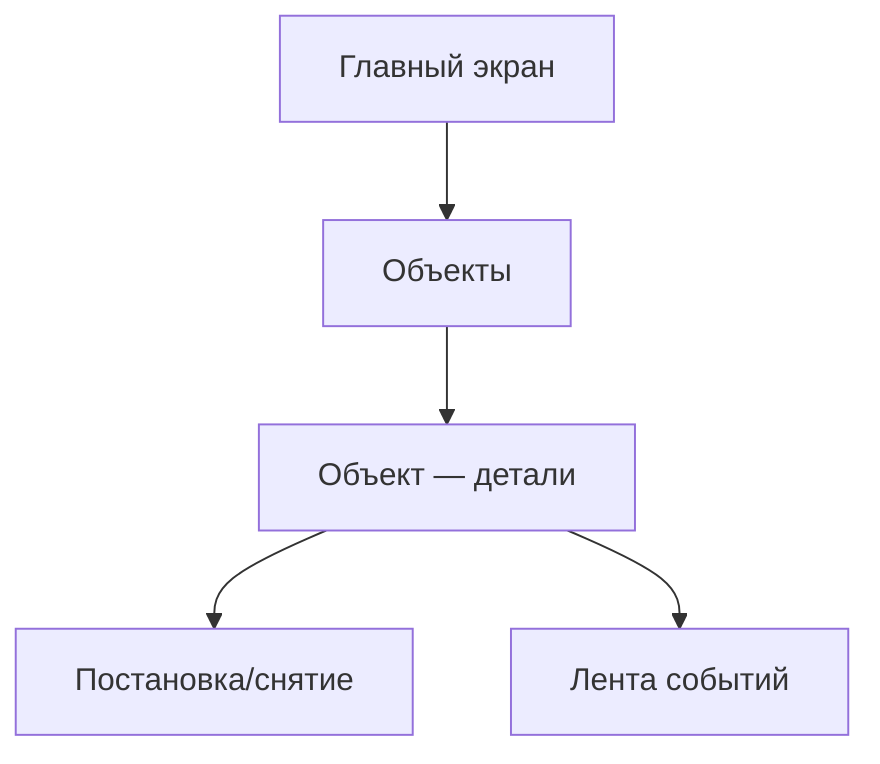

# Directive: Из PRD → Карта экранов (Sitemap)

## Когда использовать
После фиксации JTBD и персон. Цель — построить навигационную схему из функциональных требований PRD.

## Процесс

1. Прочитай `prd.md` — разделы: Функциональные требования, User Flows, Платформы
2. Выдели все Must-have (M) требования для каждой платформы
3. Сгруппируй экраны по разделам навигации
4. Построй Mermaid-диаграмму в `ia/sitemap.md`
5. Отдельные диаграммы для: мобайл, веб-ЛК, веб-магазин

## Правила группировки

- Каждый раздел навигации = узел верхнего уровня
- Экраны внутри раздела = дочерние узлы
- Модальные окна / шторки = отдельный уровень, пунктирная связь
- Состояния (пустой, загрузка, ошибка) — фиксируй отдельно в `execution/screens.md`

## Шаблон Mermaid

## Для Reforce — навигационные разделы мобайла (из PRD)

- Авторизация (OIDC + миграция)
- Главная (статус объектов)
- Объект (постановка/снятие, разделы, лента)
- Инциденты (уведомления, отчёты ГБР)
- Поддержка (чат, обращения)
- Финансы (оплата, баланс, документы)
- Профиль (пользователи, настройки, доступы)
- Онбординг / FTUE
