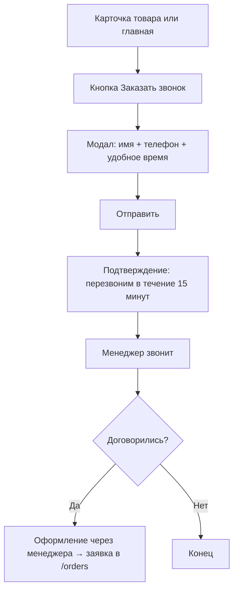

# User Flows — Reforce Маркет

> Адаптировано из `projects/reforce/ia/user-flows.md` (UF-SHOP)  
> Дополнено: /quiz как отдельная страница, landing-style карточка

---

## UF-M01: Холодный посетитель → Заявка (основной путь)

```mermaid
flowchart TD
  A[Приходит на главную /] --> B[Видит hero + CTA]
  B --> C{Понял суть?}
  C -->|Нет| D[Читает Как это работает]
  D --> B
  C -->|Да| E[Нажимает Подобрать комплект]
  E --> F[/quiz — Шаг 1: тип объекта]
  F --> G[Шаг 2: уточнение потребностей]
  G --> H[Результаты: ≤ 3 комплекта]
  H --> I{Хочет узнать подробнее?}
  I -->|Да| J[Карточка товара /p/slug]
  J --> K[Изучает: состав, выгоды, FAQ, отзывы]
  K --> L[Нажимает Оформить подключение]
  I -->|Нет| L
  L --> ORDER
```

---

## UF-M02: Форма заявки (UF-SHOP детализация)

```mermaid
flowchart TD
  ORDER[Начало оформления] --> AUTH{Авторизован?}
  AUTH -->|Нет| LOGIN[Телефон + SMS-код OIDC]
  LOGIN --> FORM
  AUTH -->|Да| FORM

  FORM[Анкета — прогресс-бар] --> S1[Шаг 1: Адрес объекта на карте]
  S1 --> S2{Уже есть объект в ЛК?}
  S2 -->|Да| S2A[Выбрать из списка]
  S2 -->|Нет| S2B[Ввести адрес]
  S2A & S2B --> S3[Шаг 2: Форма собственности]
  S3 --> S4[Шаг 3: Контактные данные]
  S4 --> S5[Шаг 4: Ответственные лица]
  S5 --> S6[Шаг 5: Документы — опционально]
  S6 --> S7[Шаг 6: Согласие + промокод]
  S7 --> WAY{Способ оформления}
  WAY -->|Сам| PAY[Оплата онлайн]
  WAY -->|Через менеджера| CALL[Менеджер перезвонит]
  PAY --> SUCCESS[Заявка создана]
  CALL --> SUCCESS
  SUCCESS --> ORDERS[/orders — Мои заявки]
```

---

## UF-M03: Управление заявкой после оформления

```mermaid
flowchart TD
  ORDERS[/orders — список] --> CARD[Карточка заявки]
  CARD --> STATUS{Статус}
  STATUS -->|Требует правок| EDIT[Редактирование анкеты]
  EDIT --> CARD
  STATUS -->|В работе| TRACK[Статус: монтаж запланирован]
  TRACK --> DATE[Дата и время монтажа]
  DATE --> DONE[Монтаж завершён]
  DONE --> LK[Объект появляется в ЛК]
  STATUS -->|Активна| CANCEL[Отмена заявки]
  CANCEL --> CONFIRM[Подтверждение отмены]
  CONFIRM --> ORDERS
```

---

## UF-M04: Обратный звонок (альтернативный путь)


