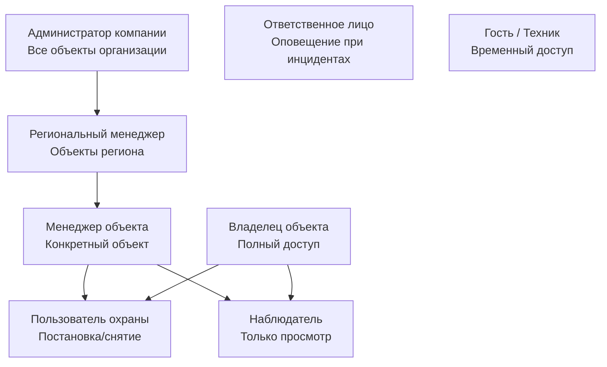
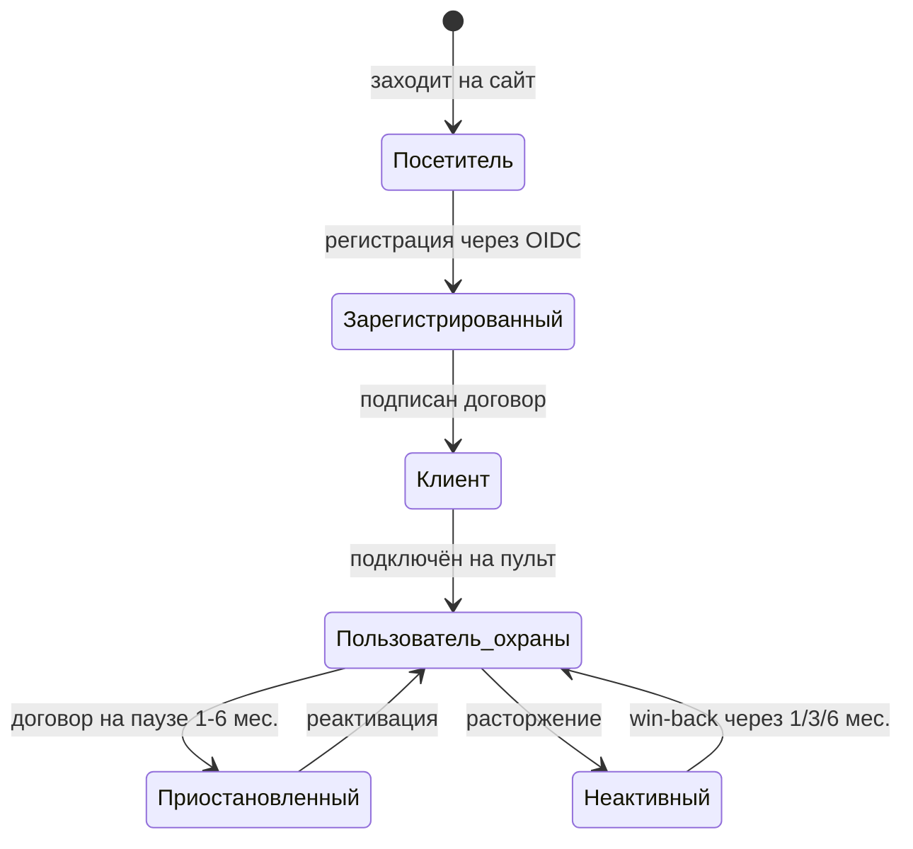

# Ролевая модель — Reforce

> Источник: PRD v3.2, раздел 4.3 и 6.0

---

## Принцип разделения мастерства

| Система | Мастер-данных | Управляет |
|---|---|---|
| **ЛК (Reforce)** | Пользователи и роли | Аккаунты, аутентификация, бизнес-роли |
| **Securige** | Охранные данные | Пользователи прибора, пинкоды, зоны, события |

**Связь:** ЛК → Securige: «назначить пользователя X на объект Y с ролью Z»  
Securige → ЛК: статусы, события, конфигурация

---

## Иерархия ролей

---

## Матрица разрешений

| Действие | Владелец | Адм. компании | Рег. менеджер | Менеджер объекта | Польз. охраны | Наблюдатель |
|---|:---:|:---:|:---:|:---:|:---:|:---:|
| Постановка/снятие объекта | ✅ | ✅ | ✅ | ✅ | ✅ | ❌ |
| Просмотр статуса | ✅ | ✅ | ✅ | ✅ | ✅ | ✅ |
| Просмотр ленты событий | ✅ | ✅ | ✅ | ✅ | ✅ | ✅ |
| Тревожная кнопка | ✅ | ✅ | ✅ | ✅ | ✅ | ❌ |
| Управление пользователями | ✅ | ✅ | Своего региона | Своего объекта | ❌ | ❌ |
| Оплата / финансы | ✅ | ✅ | ❌ | ❌ | ❌ | ❌ |
| Расторжение договора | ✅ | ✅ | ❌ | ❌ | ❌ | ❌ |
| Просмотр видео | ✅ | ✅ | ✅ | ✅ | ❌ | По настройке |
| Электронные документы | ✅ | ✅ | ❌ | ❌ | ❌ | ❌ |
| Временный доступ | ✅ | ✅ | ✅ | ✅ | ❌ | ❌ |

---

## Жизненный цикл пользователя

---

## UX-вопросы к ролевой модели

- [ ] Что видит пользователь охраны на главной, если у него нет доступа к финансам?
- [ ] Как выглядит переключение между объектами для наблюдателя с 5 объектами?
- [ ] Как визуально отображать временный доступ в списке пользователей объекта?
- [ ] Что происходит с интерфейсом при приостановке договора (FIN-05)? Какие функции блокируются?
