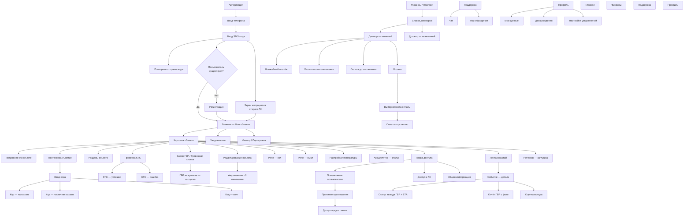
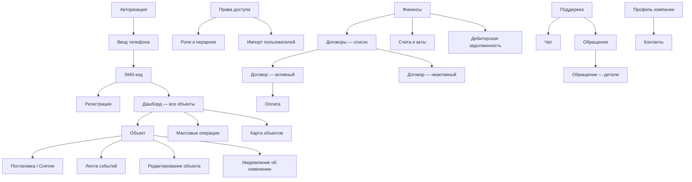
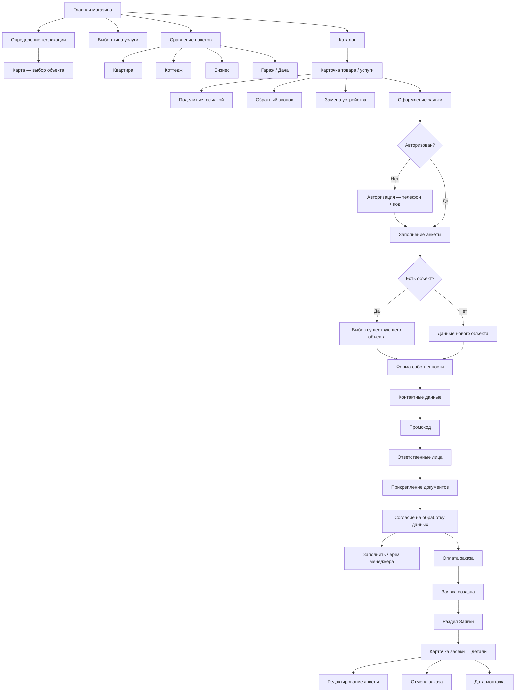

# Карта экранов — Reforce

> Источник: Figma (REFORCE, обновлено 2026-05-15) + PRD v3.2  
> Платформы: мобильное приложение (Flutter), веб-ЛК, веб-магазин

---

## Мобильное приложение (Flutter, iOS + Android)

---

## Веб-ЛК (фокус B2B)

---

## Веб-магазин

---

## Приоритет экранов — Этап 0

| Приоритет | Экран | Flow |
|---|---|---|
| 🔴 1 | Авторизация (телефон → код → вход/регистрация) | AUTH |
| 🔴 2 | Главная — список объектов со статусами | MAIN |
| 🔴 3 | Постановка/снятие (полная + раздельная + ввод кода) | OBJ_ARM |
| 🔴 4 | Проверка КТС (успех / ошибка) | OBJ_KTS |
| 🔴 5 | Push-уведомление об инциденте → статус ГБР | INC |
| 🟠 6 | Права доступа — приглашение и управление | OBJ_ACCESS |
| 🟠 7 | Оплата договора (3 сценария: ближайший / до / после) | FIN_PAY |
| 🟠 8 | Поддержка — чат | SUPPORT |
| 🟡 9 | Магазин — каталог + карточка товара | SHOP_CAT |
| 🟡 10 | Оформление заявки (полный flow) | ORDER_FORM |

---

## Открытые вопросы

- [ ] Тревожная кнопка (ГБР): хардкод в навбаре или только внутри объекта?
- [ ] Реле и температура: на каких тарифах доступны?
- [ ] Магазин и ЛК: единое приложение или отдельные точки входа?
- [ ] Замена устройства: инициируется из магазина или из ЛК?
