# User Flows — Reforce

> Источник: Figma (REFORCE, 2026-05-15) + PRD v3.2  
> Платформы: мобильное приложение (Flutter), веб-ЛК, веб-магазин

---

## UF-AUTH: Авторизация

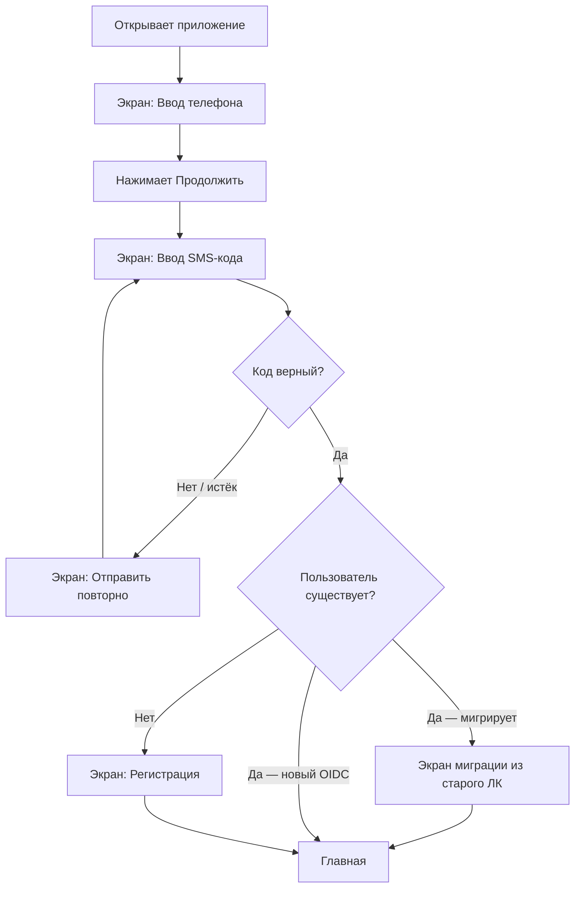

---

## UF-MAIN: Навигация по объектам

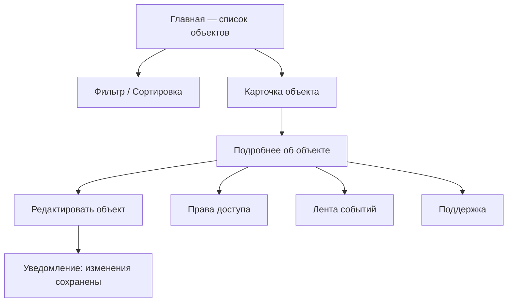

---

## UF-ARM: Постановка / Снятие с охраны

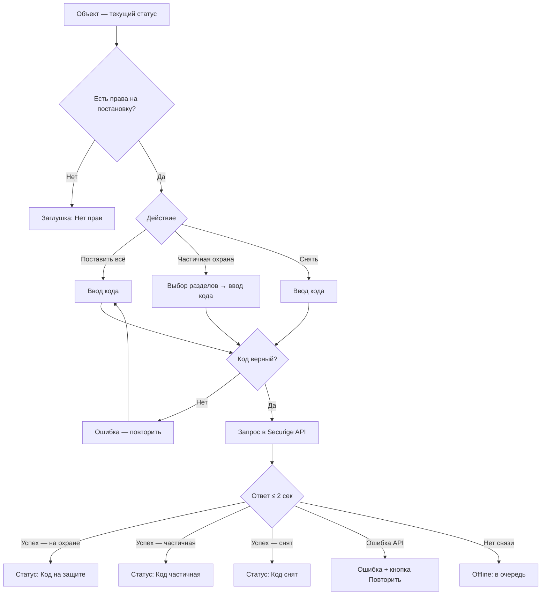

---

## UF-KTS: Проверка тревожной кнопки (КТС)

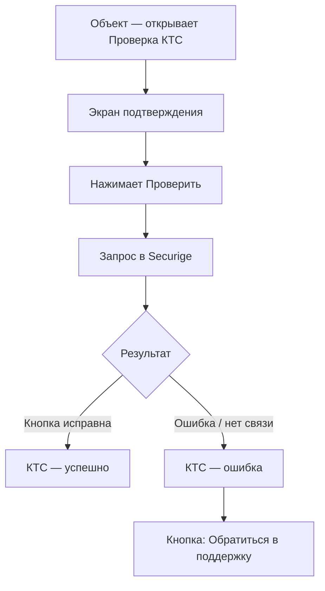

---

## UF-GBR: Вызов ГБР / Тревожная кнопка

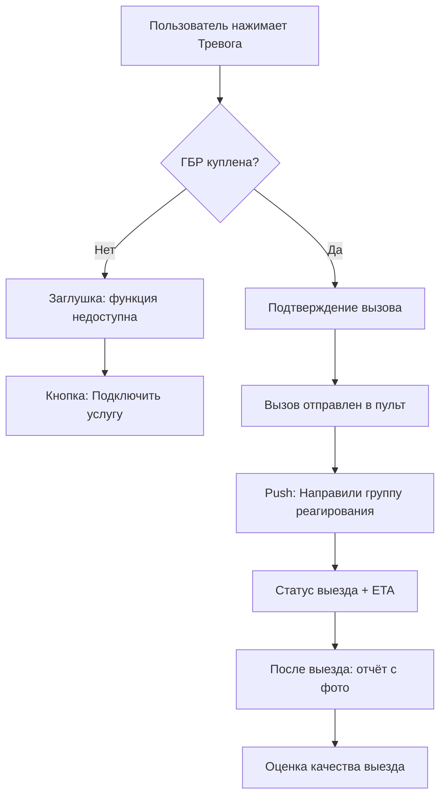

---

## UF-INC: Инцидент → уведомление → ГБР

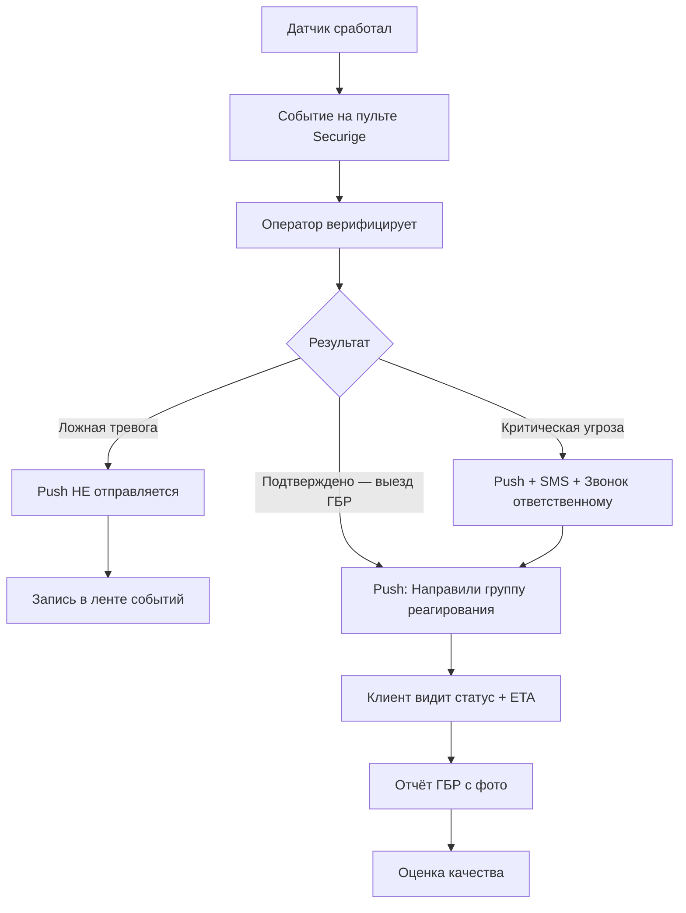

**UX-принцип:** 90%+ срабатываний — ложные. Push только при реальном выезде ГБР.

---

## UF-ACCESS: Управление правами доступа

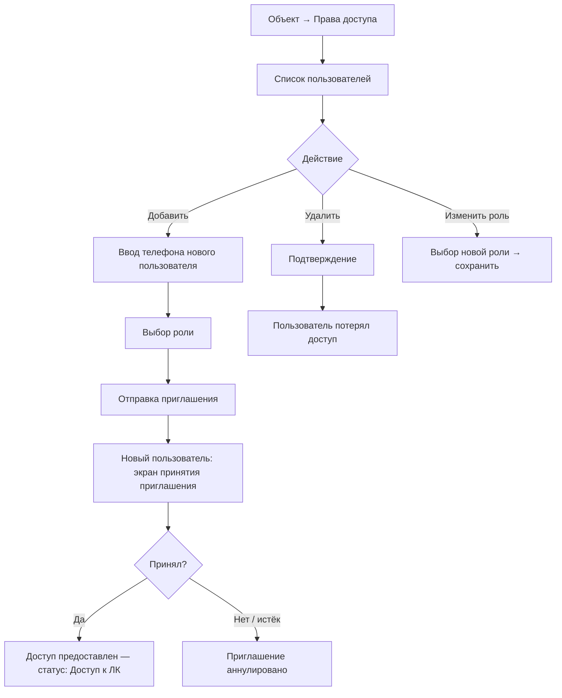

---

## UF-PAY: Оплата договора

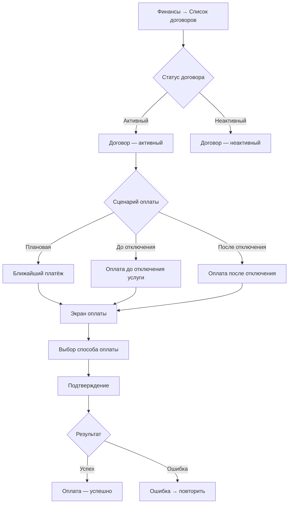

---

## UF-SHOP: Покупка → Заявка → ЛК

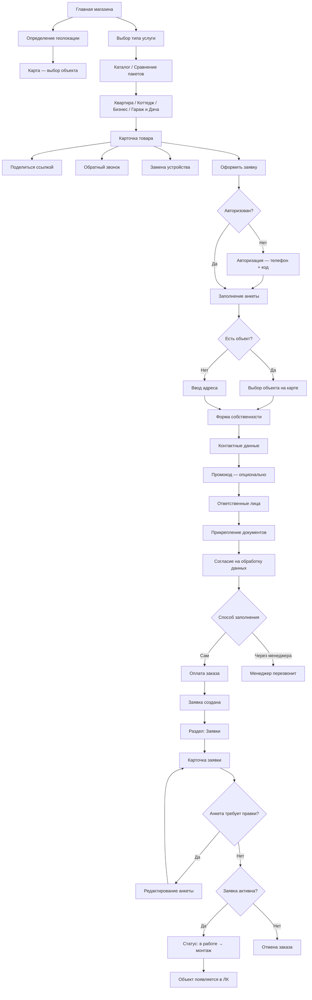

---

## UF-MIGRATE: Миграция из старого ЛК

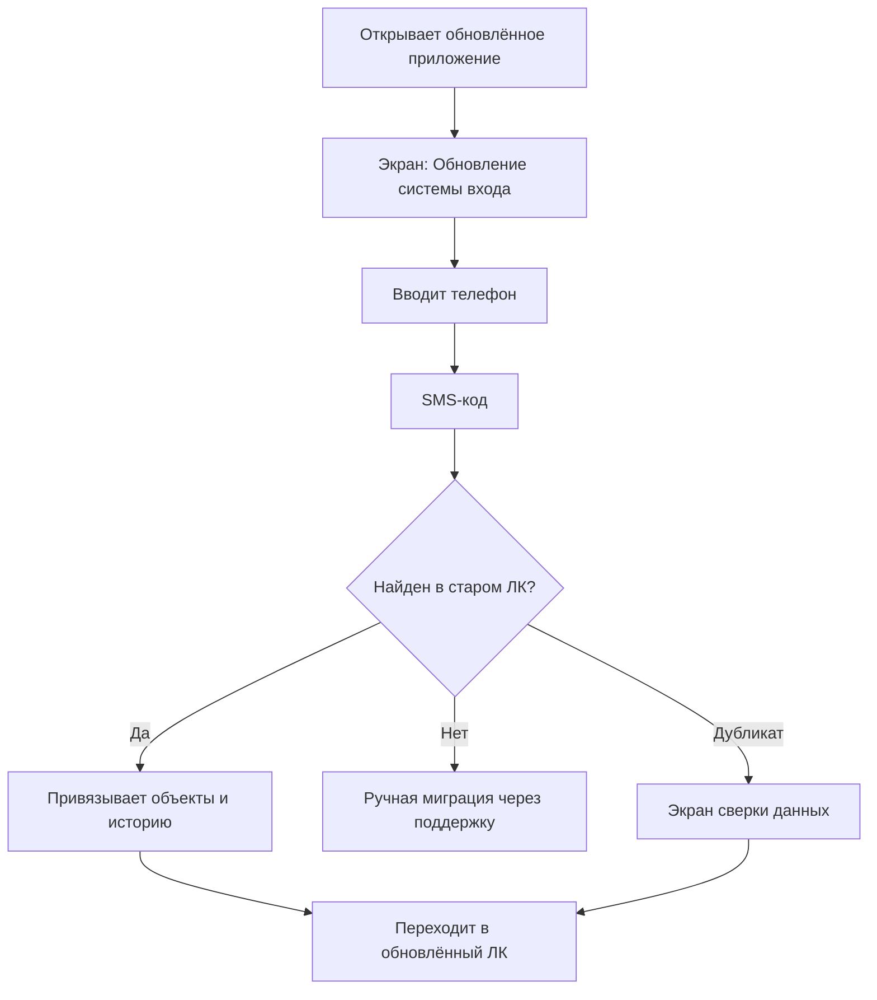

---

## UF-CANCEL: Расторжение договора

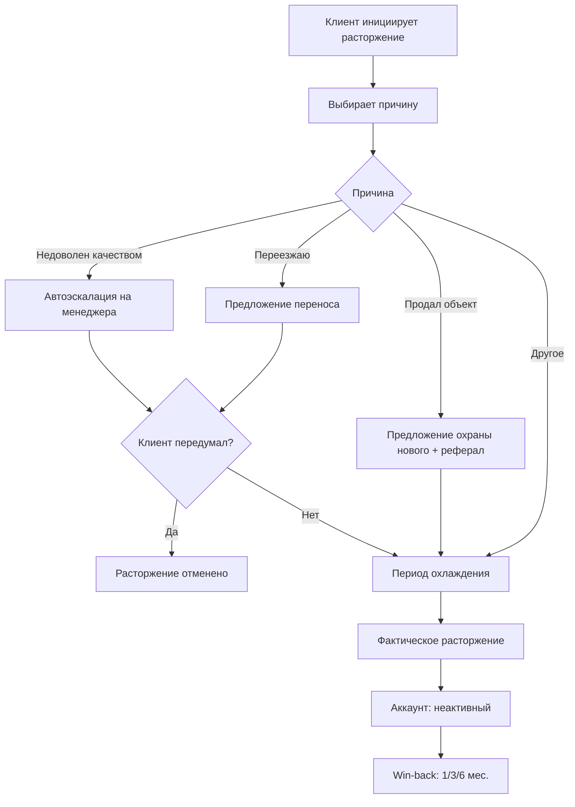

**Принцип:** расторжение — это процесс удержания, не кнопка удалить.
